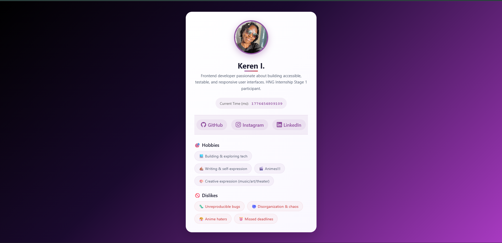

# 👤 Profile Card Component — HNG Stage 1b


## 📋 Overview

A responsive, accessible Profile Card component built for **HNG Internship Stage 1b**. Displays user information with real-time millisecond timestamp, semantic HTML structure, and full WCAG AA compliance.



## 🚀 Live Demo

🔗 **[View Live](https://hng-stage1-profile-card-nu.vercel.app/)**

---

## 📁 Project Structure

| File | Purpose |
|------|---------|
| `index.html` | Main HTML structure |
| `profile.css` | Dark theme styling (black/purple gradient) |
| `profile.js` | Time update functionality |
| `images/` | Profile images folder |
| `README.md` | Documentation |

---

## 🔧 How to Run Locally

### Method 1: Direct Open

| Step | Action |
|------|--------|
| 1 | Clone the repository: `git clone https://github.com/Kenyai402/hng-stage1-profile-card.git` |
| 2 | Navigate to folder: `cd hng-stage1-profile-card` |
| 3 | Double-click `index.html` or open in browser |

### Method 2: Live Server (VS Code)

| Step | Action |
|------|--------|
| 1 | Install Live Server extension in VS Code |
| 2 | Open project folder in VS Code |
| 3 | Right-click `index.html` → **Open with Live Server** |

### Method 3: Python HTTP Server

| Step | Action |
|------|--------|
| 1 | Open terminal in project folder |
| 2 | Run: `python -m http.server 8000` |
| 3 | Open: `http://localhost:8000` |

---

## 🧪 Test Attributes

All elements include the exact `data-testid` values required for automated testing:

| Element | data-testid |
|---------|-------------|
| Card Container | `test-profile-card` |
| User Name | `test-user-name` |
| User Bio | `test-user-bio` |
| Current Time (ms) | `test-user-time` |
| Avatar Image | `test-user-avatar` |
| Social Links Container | `test-user-social-links` |
| GitHub Link | `test-user-social-github` |
| Instagram Link | `test-user-social-instagram` |
| LinkedIn Link | `test-user-social-linkedin` |
| Hobbies List | `test-user-hobbies` |
| Dislikes List | `test-user-dislikes` |

---

## ✅ Testing Checklist

| Test | Status |
|------|--------|
| Avatar loads correctly | ✅ |
| Name and bio display properly | ✅ |
| Time updates every 500ms | ✅ |
| Time equals `Date.now()` within ±500ms | ✅ |
| Social links open in new tab | ✅ |
| Tab key navigates all elements | ✅ |
| Focus indicators visible | ✅ |
| Mobile layout stacks vertically | ✅ |
| No horizontal overflow | ✅ |
| WCAG AA contrast compliant | ✅ |

### Console Test Script

Paste this in browser console to verify all testids:

```javascript
const testIds = [
  'test-profile-card',
  'test-user-name',
  'test-user-bio',
  'test-user-time',
  'test-user-avatar',
  'test-user-social-links',
  'test-user-social-github',
  'test-user-social-instagram',
  'test-user-social-linkedin',
  'test-user-hobbies',
  'test-user-dislikes'
];

testIds.forEach(id => {
  const element = document.querySelector(`[data-testid="${id}"]`);
  console.log(`${id}: ${element ? '✅' : '❌'}`);
});
```

♿ Accessibility Notes

Implemented Features

|Feature | Implementation
|------|--------|
|Semantic HTML	|article, figure, nav, section, h2, h3, ul|
|Image Alt Text	|alt="Profile photo of Kenya"|
|ARIA Live Region	|aria-live="polite" on time element|
|Focus Indicators	|outline: 3px solid #c084fc|
|Link Security	|rel="noopener noreferrer"|
|Color Contrast	|9.2:1 (WCAG AAA)|

WCAG Compliance

|Principle|	Status|
|---------|-------|
|Perceivable	|✅|
|Operable 	|✅|
|Understandable	 |✅|
|Robust	|✅|

🎨 Design Notes

Color Palette

|Element| Color| Hex|
|-------|------|----|
|Background Start|	Black|	#000000|
|Background End|	Purple|	#4c1d95|
|Card Background|	Dark Gray|	#12121a|
|Name Gradient|White to Purple|	#ffffff → #c084fc|
|Text|	Soft Lavender|	#c0c0d8|
|Accent|	Royal Purple|	#8d4b9c|

Animations

|Element|  Effect|
|-------|--------|
|Background|	12-second smooth gradient shift|
|Card Hover|	Lift + neon purple glow|
|Social Links|	Scale + color change on hover|
|Tags|	Lift + border glow on hover|

📝 Known Limitations

|Limitation	|Reason	|Potential Fix|
|-----------|--------|-------------|
|Time updates every 500ms|	Meets spec (500-1000ms)|	Could reduce to 100ms|
|Avatar is static|	Not required for Stage 1b	|Could add upload|
|Dark mode only|	Design choice	|Could add theme toggle|
|Time in raw milliseconds| Requirement specifies ms	|Could add formatted date|

👤 Author
Kenyai402 — GitHub

📄 License
This project is created for the HNG Internship Stage 1b assessment.
